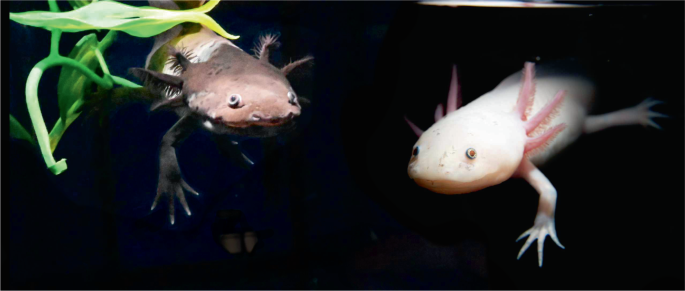

# Axolotl : Le guide complet  

## Introduction

L'**Axolotl**  est un amphibien unique, originaire des lacs de Xochimilco et Chalco au Mexique. Il est connu pour sa capacité exceptionnelle à régénérer ses membres, ainsi que pour rester à l'état larvaire tout au long de sa vie, une particularité appelée la **néoténie**.

Dans cette documentation, nous allons explorer ses caractéristiques, son habitat, son régime alimentaire, et ses besoins en captivité.

---

## Table des matières

1. [Caractéristiques de l'Axolotl](#caractéristiques-de-laxolotl)
2. [Habitat naturel](#habitat-naturel)
3. [Régénération et néoténie](#régénération-et-néoténie)
4. [Alimentation](#alimentation)
5. [Axolotls en captivité](#axolotls-en-captivité)
6. [Conservation](#conservation)
7. [Faits intéressants](#faits-intéressants)

---

## Caractéristiques de l'Axolotl

L'axolotl est connu pour ses particularités fascinantes :

- **Nom scientifique** : *Ambystoma mexicanum*
- **Famille** : Ambystomatidae
- **Taille** : 15 à 45 cm de long
- **Couleur** : Principalement gris, noir, ou albinos
- **Espérance de vie** : 10 à 15 ans en captivité

L'une des caractéristiques les plus remarquables des axolotls est leur apparence mignonne avec des branchies externes en forme de plumes qui encadrent leur tête.

---

## Habitat naturel

Les axolotls sont endémiques aux lacs situés dans la vallée de Mexico, en particulier dans le système lacustre de **Xochimilco**. Cependant, ces habitats naturels ont été gravement endommagés par la pollution et l'urbanisation. Cela fait de l'axolotl une espèce en **danger critique d'extinction** selon l'UICN.

---

## Régénération et néoténie

Une des capacités les plus incroyables de l'axolotl est sa capacité à régénérer :

- Ses membres (pattes, queue)
- Des parties de son cœur, de son cerveau et de sa moelle épinière

Contrairement à la plupart des amphibiens, les axolotls ne subissent pas de métamorphose complète. Ils conservent leurs caractéristiques larvaires, telles que leurs branchies externes, tout au long de leur vie.

---

## Alimentation

En milieu naturel, les axolotls sont carnivores et se nourrissent de :

- Petits poissons
- Vers
- Mollusques
- Larves d'insectes

En captivité, leur régime alimentaire peut être constitué de nourriture spécialisée comme des vers de terre, des pellets pour amphibiens, ou même des morceaux de viande crue.

---

## Axolotls en captivité

Pour élever un axolotl en captivité, voici quelques recommandations importantes :

- **Aquarium** : Minimum 40 litres par axolotl
- **Température de l'eau** : Entre 14°C et 20°C
- **Filtration** : Faible débit pour éviter de stresser l'animal
- **Alimentation** : Nourrir 2 à 3 fois par semaine avec des aliments adaptés

Les axolotls sont sensibles à la qualité de l'eau et à la température. Il est donc essentiel de maintenir un environnement stable.

---

## Conservation

En raison de la destruction de leur habitat naturel, les axolotls sont en danger critique d'extinction. Des efforts sont faits pour leur conservation à travers des programmes d'élevage en captivité et la restauration de leur habitat.

---

## Faits intéressants

- Les axolotls sont souvent appelés "monstres d'eau" en raison de leur nom dérivé du dieu aztèque Xolotl.
- Ils ont une capacité de régénération exceptionnelle qui est étudiée pour des applications médicales.
- En captivité, ils peuvent parfois déclencher une métamorphose s'ils sont exposés à certaines conditions, mais cela reste très rare.

---

## Conclusion

L'axolotl est un amphibien fascinant, à la fois par ses capacités biologiques uniques et par sa situation de conservation alarmante. Ce guide vous fournit un aperçu complet de leur biologie et de leurs besoins. Pour ceux qui souhaitent en apprendre davantage sur l’élevage ou la préservation de cet amphibien extraordinaire, il est essentiel de respecter les recommandations pour leur offrir un environnement optimal.

