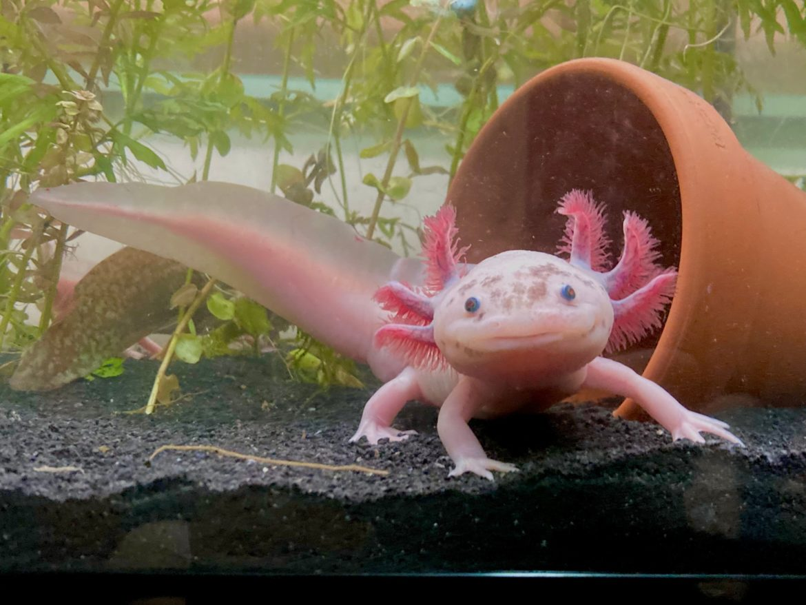
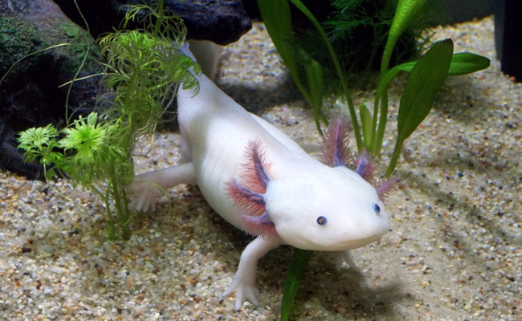
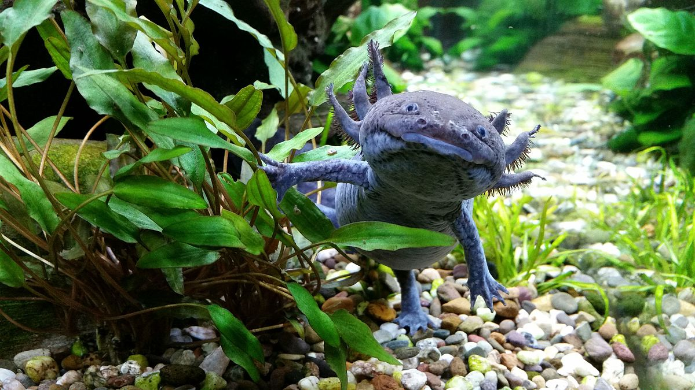
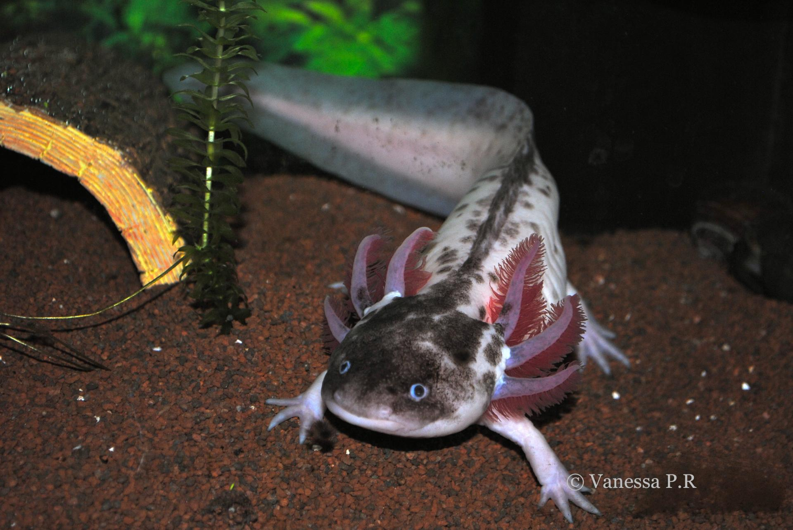

# Galerie de Photos d'Axolotls

Découvrez ces magnifiques créatures aquatiques qu'on appelle **axolotls** !

## Axolotl Rose

*Un axolotl rose nageant paisiblement dans un aquarium.*

## Axolotl Blanc Albinos

*Cet axolotl albinos a une magnifique peau blanche.*

## Axolotl Noir

*Un axolotl noir, rare et majestueux, se cache dans les plantes sous-marines.*

## Axolotl le plus rare

*Voici l'axolotl le plus rare, il est magnifique.*

---
